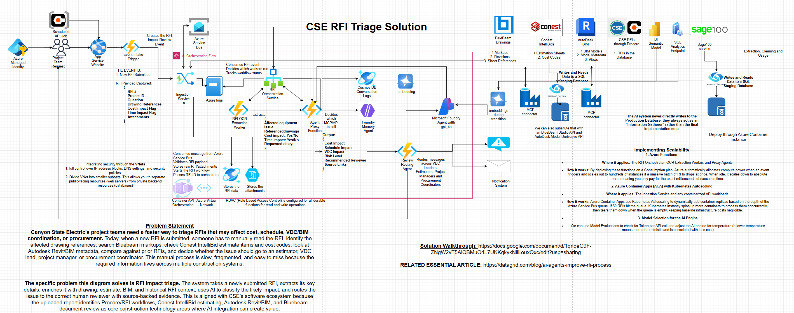

# Architecture Deep Dive



## Purpose

The CSE RFI Triage Solution reduces manual review time for RFIs that may affect cost, schedule, VDC/BIM coordination, or procurement. The system ingests newly submitted RFIs, enriches them with construction context, and routes the issue to the right reviewer with source-backed evidence.

## High-Level Flow

```text
Procore RFI event
  -> Azure Function ingestion
  -> Azure Queue Storage
  -> RFI enrichment worker
  -> RFI orchestration service
  -> OCR / drawing / BIM / estimate / historical RFI enrichment
  -> AI agent classification
  -> review routing
  -> notification and human review
```

## Core Components

### Event Intake

The RFI ingestion function receives the Procore webhook payload and validates the minimum required fields. It should stay thin and vendor-neutral beyond parsing the incoming RFI payload.

The function returns `202 Accepted` after queueing enrichment work. This keeps webhook response time independent of Autodesk token generation, manifest checks, and metadata queries.

### Orchestration

The orchestration layer coordinates enrichment workers and decides which systems need to be queried for a given RFI. This is where workflow state, retries, and task routing should live.

### Autodesk Model Derivative Context

Autodesk Model Derivative supplies BIM metadata by translating source Revit/design files into SVF2 and extracting model views, object trees, and properties.

This supports questions such as:

- Which model view or sheet relates to the RFI drawing reference?
- Which equipment, room, system, or level is affected?
- Which persistent `externalId` values should be stored for follow-up?
- Are there properties relevant to cost, schedule, clearance, or VDC impact?

### Model Derivative Webhooks

The architecture includes an APS webhook endpoint for `derivative.extraction.updated` and `derivative.extraction.finished`. In production this should resume or advance the enrichment workflow when model translation completes, instead of relying only on polling.

### AI Agent Classification

The agent should operate on normalized context rather than raw vendor payloads. Its job is to classify likely impact and recommend the reviewer path:

- cost impact
- schedule impact
- VDC/BIM impact
- risk level
- recommended reviewer
- source links

### Review Routing

The review routing agent sends the enriched RFI package to the right human reviewer group, such as VDC leads, estimators, project managers, procurement coordinators, or foremen.

## Data Boundaries

The architecture intentionally separates system boundaries:

- Procore provides RFI event context.
- Autodesk provides model derivative and metadata context.
- Bluebeam can provide sheet markup and revision context.
- Conest can provide estimate and cost-code context.
- SQL/Cosmos can store normalized mappings and workflow state.
- The AI layer should consume prepared context rather than directly owning production data writes.

## Current Codebase State

Implemented:

- Azure Function webhook shell in `src/functions/RFIIngestion.ts`
- Queue-based enrichment worker in `src/functions/RFIEnrichmentWorker.ts`
- APS Model Derivative webhook callback endpoint in `src/functions/AutodeskDerivativeWebhook.ts`
- Autodesk Model Derivative service wrapper in `src/services/autodeskService.ts`
- RFI-to-Autodesk drawing reference mapping service in `src/services/rfiAutodeskMappingService.ts`
- Azure Table Storage-backed workflow state service in `src/services/rfiWorkflowStateService.ts`
- SDK-backed methods for translation, manifests, model views, object trees, properties, specific properties, and thumbnails
- Mock/example response shapes retained in comments for future tests and onboarding

Not yet implemented:

- Procore authentication and live webhook registration
- Production drawing-reference mapping source beyond `AUTODESK_RFI_DRAWING_MAP`
- Full durable orchestration beyond persisted workflow state snapshots
- Database persistence for RFI enrichment results
- Review routing and notification integrations

## Recommended Next Milestones

1. Correlate Autodesk webhook callbacks to persisted RFI workflow state.
2. Persist full Autodesk enrichment results before review routing.
3. Replace environment-backed drawing mappings with SQL, Cosmos DB, ACC, or Bluebeam metadata.
4. Add production review routing and notification integrations.
